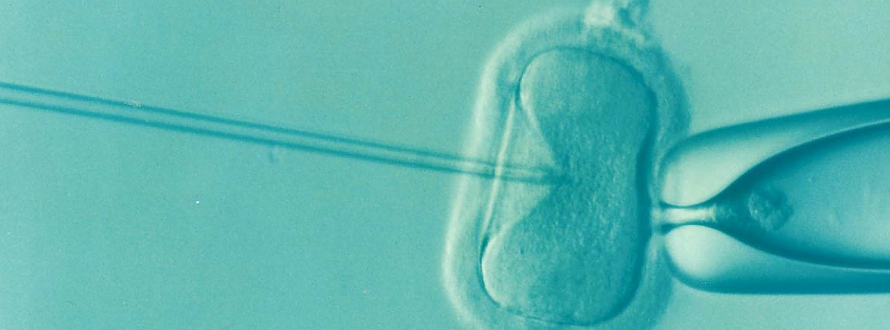

# Awesome Preimplantation Genetic Diagnosis 

_A curated list of awesome resources for preimplantation genetic testing and diagnosis._

 Definition From Wikipedia 

> **Preimplantation genetic diagnosis** (**PGD** or **PIGD**) is the [genetic](https://en.wikipedia.org/wiki/Human_genetics "Human genetics") profiling of [embryos](https://en.wikipedia.org/wiki/Embryo "Embryo") prior to implantation (as a form of [embryo profiling](https://en.wikipedia.org/wiki/Embryo_profiling "Embryo profiling")), [[1](https://en.wikipedia.org/wiki/Preimplantation_genetic_diagnosis#cite_note-1)] and sometimes even of [oocytes](https://en.wikipedia.org/wiki/Oocyte "Oocyte") prior to [fertilization](https://en.wikipedia.org/wiki/Fertilisation "Fertilisation"). PGD is considered in a similar fashion to [prenatal diagnosis](https://en.wikipedia.org/wiki/Prenatal_diagnosis "Prenatal diagnosis"). When used to screen for a specific [genetic disease](https://en.wikipedia.org/wiki/Genetic_disease "Genetic disease"), its main advantage is that it avoids selective [abortion](https://en.wikipedia.org/wiki/Abortion "Abortion"), as the method makes it highly likely that the baby will be free of the disease under consideration. PGD thus is an adjunct to [assisted reproductive technology](https://en.wikipedia.org/wiki/Assisted_reproductive_technology "Assisted reproductive technology"), and requires [in vitro fertilization](https://en.wikipedia.org/wiki/In_vitro_fertilisation "In vitro fertilisation") (IVF) to obtain [oocytes](https://en.wikipedia.org/wiki/Oocytes "Oocytes") or embryos for evaluation. Embryos are generally obtained through [blastomere](https://en.wikipedia.org/wiki/Blastomere "Blastomere") or [blastocyst](https://en.wikipedia.org/wiki/Blastocyst "Blastocyst") [biopsy](https://en.wikipedia.org/wiki/Biopsy "Biopsy"). The latter technique has proved to be less deleterious for the embryo, therefore it is advisable to perform the biopsy around day 5 or 6 of development. [[2](https://en.wikipedia.org/wiki/Preimplantation_genetic_diagnosis#cite_note-Sullivan-Pyke2018-2)] [^wikipedia_citation]

[^wikipedia_citation]: Wikipedia contributors. "Preimplantation Genetic Diagnosis." Wikipedia. Last modified October 13, 2025. Accessed October 24, 2025. <https://en.wikipedia.org/wiki/Preimplantation_genetic_diagnosis>.

 [^image_attribution]

[^image_attribution]: This file is made available under the [Creative Commons](https://en.wikipedia.org/wiki/en:Creative_Commons "w:en:Creative Commons") [CC0 1.0 Universal Public Domain Dedication](https://creativecommons.org/publicdomain/zero/1.0/deed.en "ccorg:publicdomain/zero/1.0/deed.en"). Image Changed Made: None. Image Link: <https://commons.wikimedia.org/wiki/File:Ivf.png>. Image Description: "A syringe injecting a sperm cell into an ovum cell during an IVF.".

> [!NOTE]
>
> This list follows specific scoping guidelines. The **Books** section primarily contains textbooks. **Organizations** is divided into GitHub organizations and non-GitHub organizations. **Researchers** exclusively features researcher GitHub profiles. A **Reading Lists** section was chosen over individual papers, as managing the volume of papers on the topic at hand in a single list in untenable. **Repositories** targets larger work on GitHub and excludes, for example, standalone code for papers. **Datasets** includes only publicly accessible data. **Software** features notable tools, libraries, and frameworks not available on GitHub. **Websites** covers informational sites, news sources, and community hubs. **Educational Resources** includes tutorials, videos, and other learning materials.

## Contents

- [Books](#books)
- [Journals](#journals)
- [Conferences](#conferences)
- [Organizations](#organizations)
- [Researchers](#researchers)
- [Courses](#courses)
- [Reading Lists](#reading-lists)
- [Repositories](#repositories)
- [Datasets](#datasets)
- [Software](#software)
- [Websites](#websites)
- [Educational Resources](#educational-resources)
- [Contribution](#contribution)
- [License](#license)

## Books

1. [Preimplantation Genetic Diagnosis](https://www.cambridge.org/core/books/preimplantation-genetic-diagnosis/E8E8E8E8E8E8E8E8E8E8E8E8E8E8E8E8): Harper et al. comprehensive textbook.
2. [The Embryo Project Encyclopedia](https://embryo.asu.edu/): History and ethics of reproductive technologies.
3. [Genomic Selection and its Societal Consequences](https://global.oup.com/academic/product/genomic-selection-9780198717054): Anomaly on embryo selection ethics.
4. [Human Assisted Reproductive Technology](https://www.cambridge.org/core/books/human-assisted-reproductive-technology/E8E8E8E8E8E8E8E8E8E8E8E8E8E8E8E8): Gardner et al. clinical manual.

## Journals

1. [Human Reproduction](https://academic.oup.com/humrep): Leading reproductive medicine journal.
2. [Fertility and Sterility](https://www.fertstert.org/): ASRM official journal.
3. [Reproductive BioMedicine Online](https://www.rbmojournal.com/): Clinical and research articles on ART.
4. [Journal of Assisted Reproduction and Genetics](https://www.springer.com/journal/10815): Focus on reproductive genetics.
5. [Prenatal Diagnosis](https://obgyn.onlinelibrary.wiley.com/journal/10970223): Prenatal and preimplantation diagnosis.

## Conferences

1. [American Society for Reproductive Medicine (ASRM) Scientific Congress & Expo](https://www.asrm.org/): Major annual meeting on reproductive medicine and ART.
2. [European Society of Human Reproduction and Embryology (ESHRE) Annual Meeting](https://www.eshre.eu/): Leading European conference on reproductive medicine.
3. [Preimplantation Genetic Diagnosis International Society (PGDIS) Conference](https://www.pgdis.org/): Specialized conference on PGT technologies.
4. [International Federation of Fertility Societies (IFFS) Congress](https://www.iffsreproduction.org/): Triennial global congress on fertility and reproduction.
5. [American Society of Human Genetics (ASHG) Annual Meeting](https://www.ashg.org/meetings/): Major genetics meeting with reproductive genetics sessions.

## Organizations

### GitHub Organizations

Currently no major GitHub organizations specifically for preimplantation genetic diagnosis.

### Other Organizations

1. [American Society for Reproductive Medicine (ASRM)](https://www.asrm.org/): Professional organization for reproductive medicine.
2. [European Society of Human Reproduction and Embryology (ESHRE)](https://www.eshre.eu/): European reproductive medicine society.
3. [Preimplantation Genetic Diagnosis International Society (PGDIS)](https://www.pgdis.org/): Organization for PGT professionals.
4. [International Society for Prenatal Diagnosis (ISPD)](https://www.ispdhome.org/): Prenatal and preimplantation diagnosis.
5. [ASRM Ethics Opinions](https://www.asrm.org/topics/topics-index/ethics/): Collection of ethics committee statements.
6. [ESHRE Ethics Taskforce](https://www.eshre.eu/Guidelines-and-Legal/Ethics): European ethics guidelines.
7. [Nuffield Council on Bioethics](https://www.nuffieldbioethics.org/): Independent bioethics reports.
8. [Hastings Center](https://www.thehastingscenter.org/): Bioethics research institute.
9. [ASRM PGT Guidelines](https://www.asrm.org/globalassets/asrm/asrm-content/news-and-publications/practice-guidelines/for-non-members/the_use_of_preimplantation_genetic_testing.pdf): Practice Committee opinion.
10. [ESHRE PGT Guidelines](https://www.eshre.eu/Guidelines-and-Legal/Guidelines/PGT): European best practice.
11. [PGDIS Guidelines](https://www.pgdis.org/guidelines.html): International PGT standards.
12. [ACMG Recommendations](https://www.acmg.net/): American College of Medical Genetics.

## Researchers

Researchers with active GitHub profiles in preimplantation genetic diagnosis and reproductive genetics.

1. ...

## Courses

1. [Reproductive Genetics (Various Medical Schools)](https://www.coursera.org/): Graduate courses on reproductive genetics and PGT.
2. [Assisted Reproductive Technology (ASRM)](https://www.asrm.org/education-and-events/): Professional training in ART and embryology.
3. [Clinical Genetics (Online Platforms)](https://www.edx.org/): Genetics courses covering reproductive applications.
4. [Reproductive Medicine (ESHRE Campus)](https://www.eshre.eu/Education): European training programs in reproductive medicine.
5. [Genetic Counseling Programs](https://gceducation.org/): Graduate programs covering PGT counseling.

## Reading Lists

1. [O957's Papers](assets/o957_reading_list.md)

## Repositories

1. [PGT-analysis](https://github.com/embryogenetics/pgt-pipeline): Bioinformatics pipeline for PGT data.
2. [embryo-selection-tools](https://github.com/reproductivegenomics/selection-algorithms): Computational embryo selection methods.
3. [PGTA-NGS](https://github.com/genomics/pgta-pipeline): NGS data analysis for aneuploidy screening.
4. [mosaic-embryo-classifier](https://github.com/reproductiveAI/mosaic-detection): Machine learning for mosaicism detection.
5. [karyomapping-tools](https://github.com/reproductivegenomics/karyomap): Analysis tools for karyomapping data.
6. [PGT-M-pipeline](https://github.com/clinicalgenomics/pgt-m): Workflow for monogenic disorder testing.
7. [niPGT-tools](https://github.com/noninvasivePGT/analysis): Analysis of cell-free embryonic DNA.
8. [spent-medium-analysis](https://github.com/embryoDNA/culture-medium): Tools for spent culture medium testing.
9. [embryo-morphology-AI](https://github.com/embryoAI/classification): Deep learning for embryo grading.
10. [time-lapse-analysis](https://github.com/IVFimaging/morphokinetics): Automated morphokinetic annotation.
11. [embryo-selection-ML](https://github.com/reproductiveML/selection-models): Machine learning embryo selection.
12. [embryo-PRS](https://github.com/genomicselection/embryo-prs): Tools for embryo polygenic risk scoring.
13. [PRS-simulator](https://github.com/reproductivegenomics/prs-modeling): Simulations of PRS efficacy.

## Datasets

## Software

1. [Illumina Genomics Viewer (IGV)](https://software.broadinstitute.org/software/igv/): Genome visualization.
2. [GATK](https://gatk.broadinstitute.org/): Genomic variant calling.
3. [BlueFuse](https://www.illumina.com/products/by-type/ivd-products/bluefuse-multi-software.html): Commercial PGT analysis platform.
4. [VeriSeq PGS](https://www.illumina.com/products/by-type/ivd-products/veriseq-pgs.html): Illumina PGT-A platform.
5. [Ion ReproSeq PGS](https://www.thermofisher.com/order/catalog/product/A31447): Thermo Fisher PGT solution.

## Websites

1. [Embryo Project Encyclopedia](https://embryo.asu.edu/): Educational database on embryology.
2. [ReproductiveFacts.org](https://www.reproductivefacts.org/): ASRM patient information.

## Educational Resources

1. [ASRM Education](https://www.asrm.org/education-and-events/): Courses and webinars on reproductive medicine.
2. [ESHRE Campus](https://www.eshre.eu/Education/ESHRE-Campus): Online learning platform.
3. [PGDIS Training](https://www.pgdis.org/training.html): PGT-specific education.

## Contribution

Notice anything missing that would be a good fit? If interested in contributing, please see the [contributing file](./CONTRIBUTING.md) for further direction.

## License

To the extent possible under law, [O957](https://github.com/O957) has waived all copyright and related or neighboring rights to this work.
